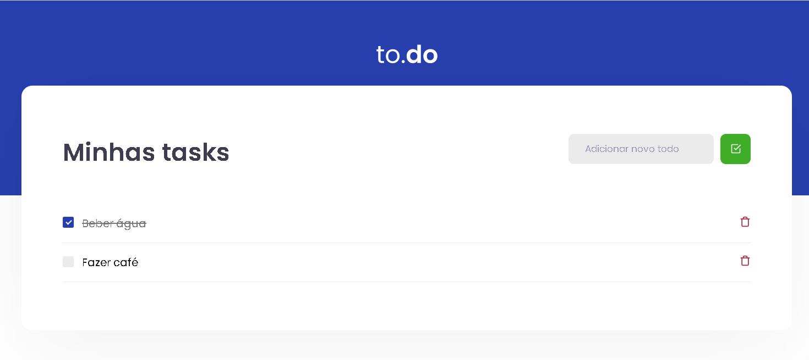

# Task List
A simple task list built with React and TypeScript.



## Running Locally

```sh
yarn install

# start the app on a new terminal window
yarn dev
```

Open [http://localhost:3000](http://localhost:3000) to view it in the browser.

## Running the tests

```sh
yarn test
```
